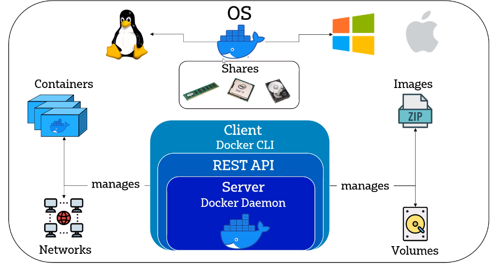
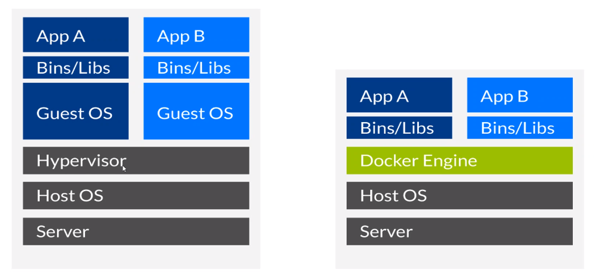
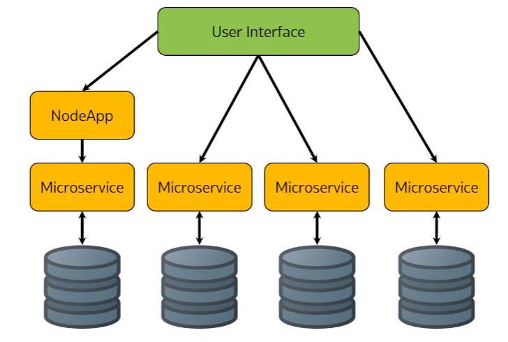

# Introduction to [Docker](https://www.docker.com/)
## What is Docker?

- Containerisation software to run programs natively on an operating system whilst still keeping them separate
- Developed by [Docker, Inc.](http://www.docker.com/company) with an open source version called [moby](https://mobyproject.org/)
- Enables users to separate your applications from infrastructure to speed up software delivery

## Why should we use docker vs VMs

- Since Virtual Machines require running a guest operating system on your host operating system, they can be considerably heavier on your computer to run
- This is especially true on low power hardware such as a laptop
- Docker by comparison uses the Docker Engine to go between your programs and your operating system
- The Docker engine reduces overheads allowing for the programs to run at near native speed

## What are the benefits
- Faster than running through a VM
- Containers are separate but can talk to each other easily
    - Can be useful for app ➡️ db situations
- The idea is to split your application into a set of smaller, inter-connected services that are:
    - Highly maintainable and testable
    - Loosely coupled
    - Organised around business capabilities
    - Owned by small teams

## Who is using docker
Some companies who are using Docker include:
- [Adobe](https://hub.docker.com/u/adobe)
- [Microsoft](https://hub.docker.com/u/microsoft)
- [Netflix](https://netflixtechblog.com/the-evolution-of-container-usage-at-netflix-3abfc096781b?source=social.tw )
- Twitter

## What is Micro-services architecture

- The architecture allows for multiple programs to run on one operating system
- A microservices architecture consists of a collection of small, autonomous services.
- Each service is self-contained and should implement a single business capability within a bounded context, which can be managed by a small development team.
- Services can be deployed independently. A team can update an existing service without rebuilding and redeploying the entire application.

## Micro-services architecture vs Monolith and use cases 
- Agility, since microservices are deployed independently, it's easier to manage bug fixes and feature releases.
- Small, focused teams. A microservice should be small enough that a single feature team can build, test, and deploy it. Large teams tend be less productive, because communication is slower.
- Small code base. Code dependencies in a monolithic application tend to grow entangled over time. Adding a new feature necessitates touching code in several places. A microservices design reduces dependencies by not sharing code or data storage, making it easier to add new features.

## Is Micro-services architecture always useful?
- Sometimes monolith architectures allow for easier integration into environments since it's just one program running at any one time
- Monolith also provides maximum compatibility since as long as you can run the os, if a program is compatible it should just run

## The reader should note
Sometimes Docker doesn't run on Windows, so use: `alias docker="winpty docker"` to help with the association

## Copying to ngnix
To copy a file to nginx in a docker instance you can use the command:
```console
docker cp [path to file] [docker container id]:[path to destination]
```
I copied over `index.html` and if all goes well you should see a heading, a line of text and an image!

You may preview the page [here](http://monotiller.github.io/engineering89_docker)

## Pushing to Docker hub
You can push a container to Docker hub and it'll act like a repo. [Here's one](https://hub.docker.com/r/monotiller/engineering89_docker).
- Commit a container: `docker commit [CONTAINER ID] [USERNAME]/[REPO NAME]:[TAG NAME]`. Note that if no tag name is given then `latest` will be added by default
- To push to the hub: `docker push [USERNAME]/[REPO NAME]:[TAG NAME]`

## Pulling from Docker hub
- If you want to run straight away you can just use: `docker run [USERNAME]/[REPO NAME]:[TAG NAME]`
- But you may also just pull: `docker pull [USERNAME]/[REPO NAME]:[TAG NAME]`

## Creating a Dockerfile
Building customised Docker images

Build an image to automate the tasks to launch static website/page using nginx webserver with Docker

- Use the official image nginx
- `FROM` is the keyword to use the image
    ```Dockerfile
    FROM nginx
    ```
- Label it with your name or email
- This is optional
    ```Dockerfile
    LABEL MAINTAINER=[NAME/EMAIL]
    ```
- Copy it over to the container
- Copy the folder/file from localhost to the container
- Copy the data as our index.html/app1
    ```Dockerfile
    COPY [FROM] [TO]
    ```
- Declare to use default port 80 for nginx
    ```Dockerfile
    EXPOSE 80
    ```
- CMD with the final command - example; `npm start`
    ```Dockerfile
    CMD [ "nginx", "-g", "daemon off;" ]
    ```
- We get this from the official image of nginx

### Building
Then to build it we simply do:
```console
docker build -t [USERNAME]/[REPO NAME] .
```
The `.` is important as it means "use the Dockerfile in the local repository"

### Running
Run as normal!

## Volumes
Volumes are a great way to sync changes between what's on your device and what's on the container. Syncing is done in real time!
```console
docker run -d -v [FOLDER TO SYNC]:[LOCATION ON CONTAINER] [USERNAME]/[REPO NAME]
```
`-v` means "volume" and is specifying you want to launch a volume